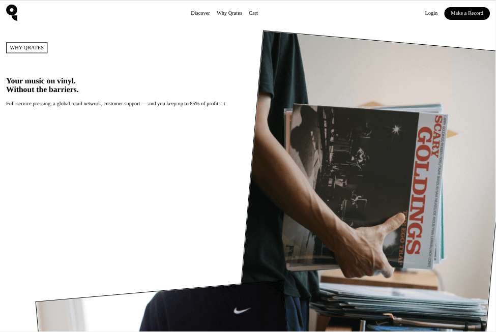
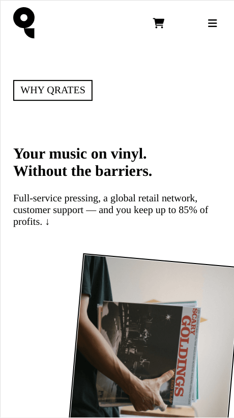

<h1 align="center">qrates</h1>

   Solution for a challenge from  <a href="https://frontendpractice.com" target="_blank">Frontendpractice.com</a>.

  <h3>
    <a href="https://jdegand.github.io/qrates/">
      Github Pages
    </a>
     | 
    <a href="https://www.frontendpractice.com/project/qrates">
      Frontend Practice    
    </a>
  </h3>

## Table of Contents

- [Overview](#overview)
  - [Built With](#built-with)
- [Features](#features)
- [Useful Resources](#useful-resources)

## Overview

### Built With

- Grid 
- Flex
- Used pictures from frontpage of qrates as replacements for instagram pictures

## Features

The [challenge](https://www.frontendpractice.com/project/qrates) was to build an application to complete the following user stories:

- [x] User story: Recreate the layout of the qrates.com/why
- [x] User story: Create the toggles & transition for the "Artists on Qrates" section.
- [x] User story: Animate the images above the "Try it now" button at the bottom of the page.

## Useful Resources

- [Qrates](https://web.archive.org/web/20210815222754/https://qrates.com/why)
- [Font Awesome](https://fontawesome.com/v5.15/icons?d=gallery&p=2) - Icons
- [Font Awesome](https://fontawesome.com/v5.15/how-to-use/on-the-web/styling/sizing-icons) - Sizing Icons
- [Tutorials Point](https://www.tutorialspoint.com/html/html_marquees.htm) - Marquees
- [W3](https://www.w3docs.com/learn-html/html-marquee-tag.html) - Marquee tag
- [Stack Overflow](https://stackoverflow.com/questions/31951282/why-is-marquee-deprecated-and-what-is-the-best-alternative) - Deprecation of marquee tag
- [Codepen](https://codepen.io/scwall/pen/mdemeER) - Marquee
- [Codepen](https://codepen.io/iPawan/pen/BKkCo) - CSS Flash and Pulse Effects
- [Stack Overflow](https://stackoverflow.com/questions/7086290/javascript-image-change-after-x-amount-of-time) - Images & Interval